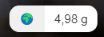

# Website Carbon Meter

Tracks the carbon emissions of a website as live metrics. Based on [CO2.js](https://github.com/thegreenwebfoundation/co2.js) and and the [actual grid carbon intensity](https://github.com/bluehands/Carbon-Aware-Computing).

## How it works

This project is based on [CO2.js](https://github.com/thegreenwebfoundation/co2.js) from the [Green Web Foundation](https://www.thegreenwebfoundation.org/) which correlates the number of transferred bytes of a Website into the carbon emissions. With the aim of the Performance API the transferred bytes are collected.

There are two stages. First after loading of the site, all resources are collected and counted. In the second stage, all background activities are monitored and also counted. Currently all requests from **fetch** and **XmlHttpRequest** are observed.

The total number of emissions is stored in the session cache of the browser and is available as long the browser tab is not closed.

To get the total number and the last request, consumer have to provide a callback function.

To calculate the carbon emissions, the electric energy has to multiplied by the grid carbon intensity. The current intensity is downloaded from the [Carbon-Aware-Computing project](https://github.com/bluehands/Carbon-Aware-Computing) as a efficient json file. The file contains the forecast for the next 24h and is updated several times a day. The file is cached from the browser and additionally in the local storage of the website.

## How to use

There are two major usage scenario:

* Use the Badge WebComponent
* Use the lib directly

### Carbon Meter Badge

[](https://www.npmjs.com/package/website-carbon-meter-badge)
[](https://www.jsdelivr.com/package/npm/website-carbon-meter-badge)

Simply use the Carbon Meter Badge WebComponent in your html page. Add a reference to the lib as a script module in the header:

```html
<script type="module"
    src="https://cdn.jsdelivr.net/npm/website-carbon-meter-badge/bundle/website-carbon-meter-badge.js">
    </script>
```

and put the component in the right place of your website and set the location of your hosting server.

``` html
<carbon-meter-badge location="de"></carbon-meter-badge>
```



There are a few properties to adjust the component:

* location: *(default: de)* The location of the website. This is used to get the grid carbon intensity. See below for a list of supported regions.
* theme: *light | dark (default:light)* Set the theme to use.
* appearance: *compact | inherit (default compact)* Set the badge style - font-size and line-height - to have a more compact badge.
* link: *(default: github url)* The click on the badge will redirect to a website with further details. You may point to your site. We ask kindly for a citation.
* label: *(default:* 🌍*)* Change the badge text.
* tooltip: Set the text which appears on mouse over

### Carbon Meter SDK

[](https://www.npmjs.com/package/website-carbon-meter)
[](https://www.jsdelivr.com/package/npm/website-carbon-meter)

Use the jsDeliver or directly the package from npm to reference the lib.

``` html
<script type="module">
    import CarbonMeter from "https://cdn.jsdelivr.net/npm/website-carbon-meter/bundle/website-carbon-meter.js"
    //import CarbonMeter from "./node_modules/website-carbon-meter/bundle/website-carbon-meter.js"

    let cm = new CarbonMeter('de');
    cm.onMetering(
        (sessionTotalCo2, lastRequestCo2) => {
            let msg = `Carbon emissions: Session ${sessionTotalCo2.toFixed(2)}g (Last request ${lastRequestCo2.toFixed(2)}g)`;
            document.getElementById("carbon-emissions").innerText = msg;
        }
    );
    cm.start();
</script>
```

For more samples see the sample static website.

## Limitation

### CORS

The [PerformanceResourceTiming](https://developer.mozilla.org/en-US/docs/Web/API/PerformanceResourceTiming) of the [Performance API](https://developer.mozilla.org/en-US/docs/Web/API/Performance_API) respects the CORS-Settings **Timing-Allow-Origin** to measure the performance and transferred bytes of backgroud requests. If the CORS-Timing is not set, the collected transferred bytes of fetch and XmlHttpRequest is zero.

### Supported Regions

The Carbon-Aware-Computing projects supports only the Grid Carbon Intensity for regions in Europe. For other regions WattTime or ElectricyMap must be used.

In respect of sustainable computing not all European countries are actively provided. To get a list of active regions use
```bash
curl -X GET "https://forecast.carbon-aware-computing.com/locations" -H  "accept: application/json"
```
If a region is not active, just drop a mail to [am@bluehands.de] (mailto:am@bluehands.de) to activated it.

### Same region for hosting, network and device

There is currently no autodetection of the browser location and the script assumes that the browser is in the same grid region as the website and API host.